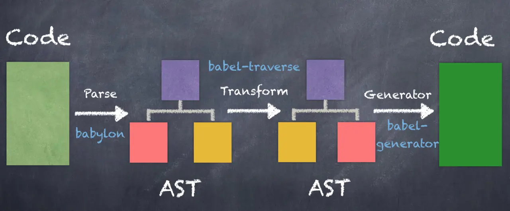

# 核心概念

package.json 配置启动项
webpack --env production 为 配置文件传递参数

    module.eports = (env) = {
        return generateConfig(env)
    }

## Entry  

入口起点
配置多个入口文件，也只有一个输出点；

    entry: {
        app: './app.js',
        vendors: './vendors.js'
    }

## Output

    module.exports = {
        entry: {
            app: './src/app.js',
            vendor: './src/vendors.js'
        },
        output: {
            filename: '[name].js',
            path: __dirname + '/dist'
        }
    }

>__dirname: 总是返回被执行的 js 所在文件夹的绝对路径  
__filename: 总是返回被执行的 js 的绝对路径  
process.cwd(): 总是返回运行 node 命令时所在的文件夹的绝对路径  
./: 跟 process.cwd() 一样，返回 node 命令时所在的文件夹的绝对路径  

### publicPath  

dev mode 不配置参数  
build mode 配置绝对路径

## Loader

>JavaScript只认为JavaScript文件是模块，而webpack的设计思想即万物皆模块，为了使得webpack能够认识其他“模块”，所以需要loader这个“编译器”

    loader: {
        rules: [
            {
                test: /\.css$/,
                use: ['style-loader', 'css-loader'], // rules 的执行顺序是从右往左，从下往上
            }]
    }

## Plugins

>插件执行打包、优化、压缩、搭建服务等，使用插件一般先使用npm包管理器进行安装，然后在配置文件中引入，最后将其实力传递给plugins数组属性；

    const webpack = require('webpack');
    module.exports = {
        plugins: [
            new webpack.optimize.UgilifyJsPlugin();
        ]
    }

## Mode

webpack 根据Mode属性值会自动进行压缩优化。

## 动态生成js文件 添加hash值

## optimisation

## babel

### babel-core  

Babel 编译器，可以将 js 代码抽象成 ast （abstract syntax tree）。

### balel-cli  

提供命令运行 babel。

### babel-runtime

避免babel编译的工具函数在每个模块里重复出现。
babel转译后的代码要实现源代码同样的功能需要借助一些帮助函数，可能会重复出现在一些模块里，导致编译后的代码体积变大。babel-runtime 供编译模块复用工具函数。

### core-js

用于 JavaScript 的组合式标准化库，包含ES5, ES6的 Promise, Symbols, Collections, Iterators, Typed arrays, es7+ 提案等等的 polyfills 实现。

### regenerator

来自于 fb 的一个库，主要就是实现了 generator/yeild, async/await。所以babel-runtime 是单纯的实现了core-js 和 regenerator 引入和导出。

### babel-polyfill

Babel 默认只转换新的 JavaScript 语法，而不转换新的 API。例如， Iterator、Generator、Set等全局对象，以及定义在全局对象上的方法如Object.assign都不会转换，如果想使用这些新的对象和方法，必须使用 babel-polyfill，为当前环境提供一个垫片。 babel-polyfill是一次性引入到你的项目中，需要同项目代码一同编译到生产环境的。

### babel-polyfill 和 transform-runtime的不同

babel-polyfill是当前环境注入ES6+的标准垫片，一次引用，全局使用。缺点就是会污染原生的一些方法而把原生的方法重写。如果只是用几个特性，就没有必要引入这个包而大大增加体积。
transform-runtime是利用plugin自动识别，并替换代码中的新特性。不需要再引入，只需要装好babel-runtime，配置好plugin就可以了。按需替换，检测需要哪个，就引入哪个polyfill。而且transform-runtime不会污染原生的对象、方法，也不会对其他的polyfill产生影响。所以更适合开发工具包、库。缺点就是随着应用的增大，相同的polyfill每个模块都要做重复的工作。

### plugin babel-plugin-transform-runtime

transform-runtime 是为了方便使用 babel-runtime的，它会分析ast中是否有引用babel-runtime中的垫片，如果有就会在当前模块的顶部插入我们需要的垫片。

    {
        "plugins":[
            ["transform-runtime", {
                "helpers":true,
                "polyfill":true,
                "regenerator":true,
                "moduleName": "babel-runtime"
            }]
        ]

### presets

presets是plgugins的组合

+env  
+es2015  
+react  
+lastet  
+stage-x  
babel-preset-lastet (包括 es2015, es2016, es2017)跟默认情况下的env是一样的，包括lastet在内，这四个presets都被babel-preset-env代替。

### babel-preset-env

根据当前的运行环境，自动确定需要的plugins和polyfills。通过各个es标准feature在不同浏览器以及node版本的支持情况，再去维护一个feature跟plugins之间的映射关系最终确定需要的plugins。

    // .babelrc

    {
        "presets":[
            [
                "env",
                {
                    "targets": { // 配支持的环境
                        "browsers":[ // 浏览器
                            "last 2 versions",
                            "safari >=7"
                        ],
                        "node":"current" //node 支持版本
                    },
                    "modules": true, // 设置 ES6，模块转移的模块格式，默认是 commonJs
                    "debug":true, // 编译的时候 console
                    "useBuiltIns":false, // 是否开启自动支持polyfill
                    "include":[], // 总是启用哪些 plugins
                    "exclude":[] // 强制不启用那些 plugins，用来防止某些插件被启用
                }
            ]
        ],
        "plugins": [
            "transform-react-jsx" // 如果是需要支持jsx，需要单独装
        ]
    }

### useBuiltIns

env 会根据我们的运行环境去判断所需要的 polyfill，而且，打包后的代码体积也会大大减小，但是这一切都在使用useBuiltIns，而且需要安装 babel-polyfill,并import。他会启动一个插件，替换 import 'babel-polyfill',不是整个引入，而是根据配置的环境和个人的需要单独的引入 polyfill。

# plugins

## webpack-bundle-analyzer  

> webpack的打包优化解决方案，查看项目所有的包及包的体积；  

## ES模块  

### module export default, export, import { xX } from, import xX from 的初步理解  

    e.g export default
    // a.js 
    export default (nameStr) => console.log(nameStr)
    // b.jd 
    import showName from './a'
    showName('Leo')

    e.g export
    //a.js
    function showName(nameStr) {
        console.log(nameStr)
    }
    export{
        showName
    }
    //b.js
    import {showName} from './a'
    showName('Leo')

## node 模块

### exports module.exports 导出 require 导入  

## CSS tree shaking  

### 用到的包 glob-all purify-css purifycss-webpack， 遇到技术上的问题，目前先略过  
